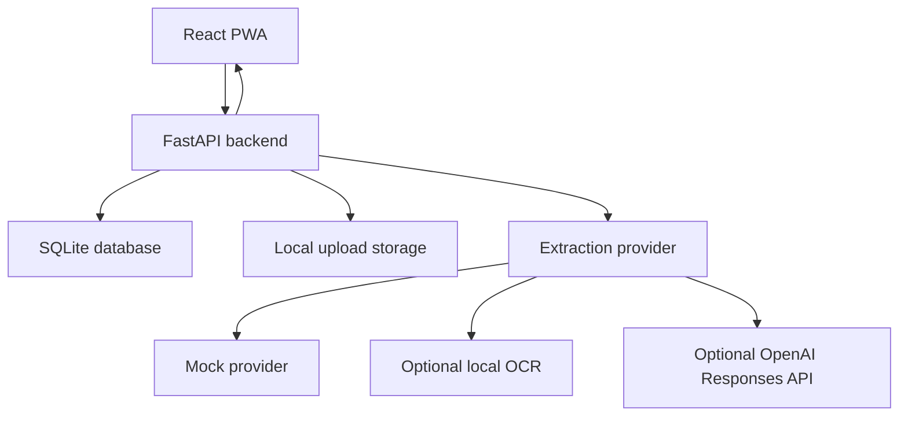

# Technical Architecture

## Overview

MedShelf should use a small frontend/backend architecture that is easy to build during the hackathon and easy for judges to run.

## Frontend

Recommended:

- React
- Vite
- TypeScript
- Tailwind CSS or CSS modules
- React Router

Core screens:

- Dashboard
- Medicine list
- Medicine detail
- Add/edit medicine
- Leaflet upload
- AI review
- Settings/demo data

## Backend

Recommended:

- FastAPI
- Pydantic models
- SQLModel or SQLAlchemy
- SQLite
- Uvicorn

Core API routes:

- `GET /api/medications`
- `POST /api/medications`
- `GET /api/medications/{id}`
- `PATCH /api/medications/{id}`
- `DELETE /api/medications/{id}`
- `POST /api/medications/{id}/doses`
- `POST /api/medications/{id}/leaflet`
- `POST /api/leaflets/{id}/extract`
- `POST /api/leaflets/{id}/approve`
- `GET /api/restock/suggestions?medication_id=...`

## AI Flow

1. User uploads a leaflet image, PDF, or text fixture.
2. Backend stores the file.
3. Backend runs the configured extraction provider: `mock` by default, optional
   `local_ocr`, or optional `openai`.
4. Provider returns structured JSON or a recoverable failure.
5. Backend validates parsed output with Pydantic.
6. Backend stores raw output and parsed output with `needs_review=true`.
7. Frontend shows review UI in the next milestone.
8. User edits/approves reviewed guidance in the next milestone.

## Database Tables

### medications

- `id`
- `name`
- `active_ingredients`
- `form`
- `strength`
- `quantity_remaining`
- `quantity_unit`
- `dose_amount`
- `dose_unit`
- `low_stock_threshold`
- `notes`
- `created_at`
- `updated_at`

### schedules

- `id`
- `medication_id`
- `times`
- `days_of_week`
- `start_date`
- `end_date`

### dose_logs

- `id`
- `medication_id`
- `scheduled_at`
- `taken_at`
- `status`
- `quantity_delta`

### leaflet_extractions

- `id`
- `leaflet_upload_id`
- `medication_id`
- `provider`
- `source_text`
- `raw_model_output`
- `parsed_output`
- `error_message`
- `status`
- `created_at`
- `updated_at`

## Error Handling

- If AI extraction fails, show a retry button and preserve upload.
- If extraction is uncertain, keep `needs_review` true.
- If inventory would become negative, warn but allow user correction.
- If the app is offline, keep the tracker usable and disable AI upload.

## Deployment Notes

For the hackathon, prefer a simple public deployment. If split hosting becomes too slow, use one backend that serves built frontend static files.
