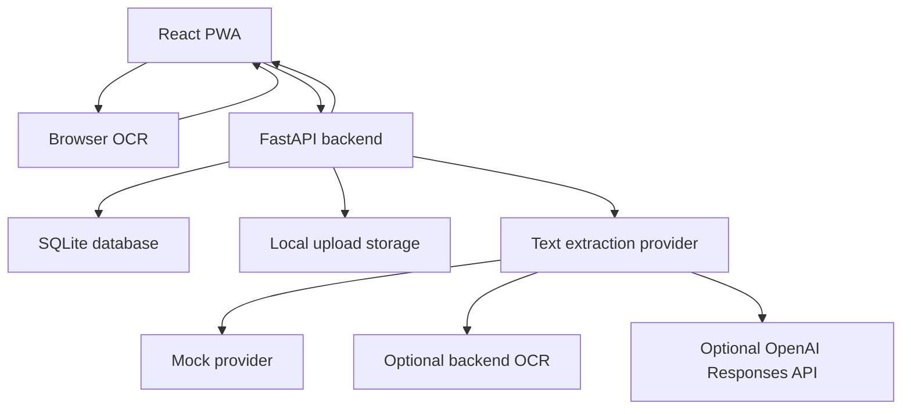

# Technical Architecture

## Overview

MedShelf should use a small frontend/backend architecture that is easy to build during the hackathon and easy for judges to run.

## Frontend

Recommended:

- React
- Vite
- TypeScript
- Tailwind CSS or CSS modules
- React Router

Core screens:

- Dashboard
- Medicine list
- Medicine detail
- Add/edit medicine
- Routine and non-routine storage-only medicine tracking
- Leaflet upload and browser OCR
- AI review
- Settings/demo data

## Backend

Recommended:

- FastAPI
- Pydantic models
- SQLModel or SQLAlchemy
- SQLite
- Uvicorn

Core API routes:

- `GET /api/medications`
- `POST /api/medications`
- `GET /api/medications/{id}`
- `PATCH /api/medications/{id}`
- `DELETE /api/medications/{id}`
- `POST /api/medications/{id}/doses`
- `POST /api/medications/{id}/leaflet`
- `GET /api/medications/{id}/leaflet-guidance`
- `GET /api/leaflets/{id}/extraction`
- `POST /api/leaflets/{id}/extract`
- `POST /api/leaflets/{id}/extract/browser-ocr`
- `POST /api/leaflets/{id}/approve`
- `GET /api/restock/suggestions?medication_id=...`

## AI Flow

1. User selects a leaflet image, PDF, or text fixture.
2. For images, the browser shows a preview, runs no-paid OCR where possible, and
   lets the user edit or paste OCR text before extraction.
3. Backend stores the original uploaded file.
4. If browser OCR text is submitted, the backend stores it as `source_text` and
   parses it with the conservative `browser_ocr` path.
5. Otherwise, the backend runs the configured extraction provider: `mock` by
   default, optional `local_ocr`, or optional `openai`.
6. Provider returns structured JSON or a recoverable failure.
7. Backend validates parsed output with Pydantic.
8. Backend stores raw output and parsed output with `needs_review=true`.
9. Frontend shows the draft in an editable review UI with confidence and source
   snippets.
10. User edits/removes fields and approves reviewed guidance.
11. Backend saves a reviewed guidance record and marks the upload/extraction as
   `approved`.

## Database Tables

### medications

- `id`
- `name`
- `active_ingredients`
- `form`
- `strength`
- `is_routine`
- `quantity_remaining`
- `quantity_unit`
- `dose_amount`
- `dose_unit`
- `low_stock_threshold`
- `notes`
- `created_at`
- `updated_at`

### schedules

- `id`
- `medication_id`
- `times`
- `days_of_week`
- `start_date`
- `end_date`

### dose_logs

- `id`
- `medication_id`
- `scheduled_at`
- `taken_at`
- `status`
- `quantity_delta`

### leaflet_extractions

- `id`
- `leaflet_upload_id`
- `medication_id`
- `provider`
- `source_text`
- `raw_model_output`
- `parsed_output`
- `error_message`
- `status`
- `created_at`
- `updated_at`

### leaflet_guidance

- `id`
- `medication_id`
- `leaflet_upload_id`
- `leaflet_extraction_id`
- `reviewed_output`
- `created_at`
- `updated_at`

## Error Handling

- If browser OCR fails, let the user paste text manually or store the upload
  without extraction.
- If AI extraction fails, show a retry button and preserve upload.
- If extraction is uncertain, keep `needs_review` true.
- If inventory would become negative, warn but allow user correction.
- If the app is offline, keep the tracker usable and disable AI upload.

## Deployment Notes

For the hackathon, prefer a simple public deployment. If split hosting becomes too slow, use one backend that serves built frontend static files.
